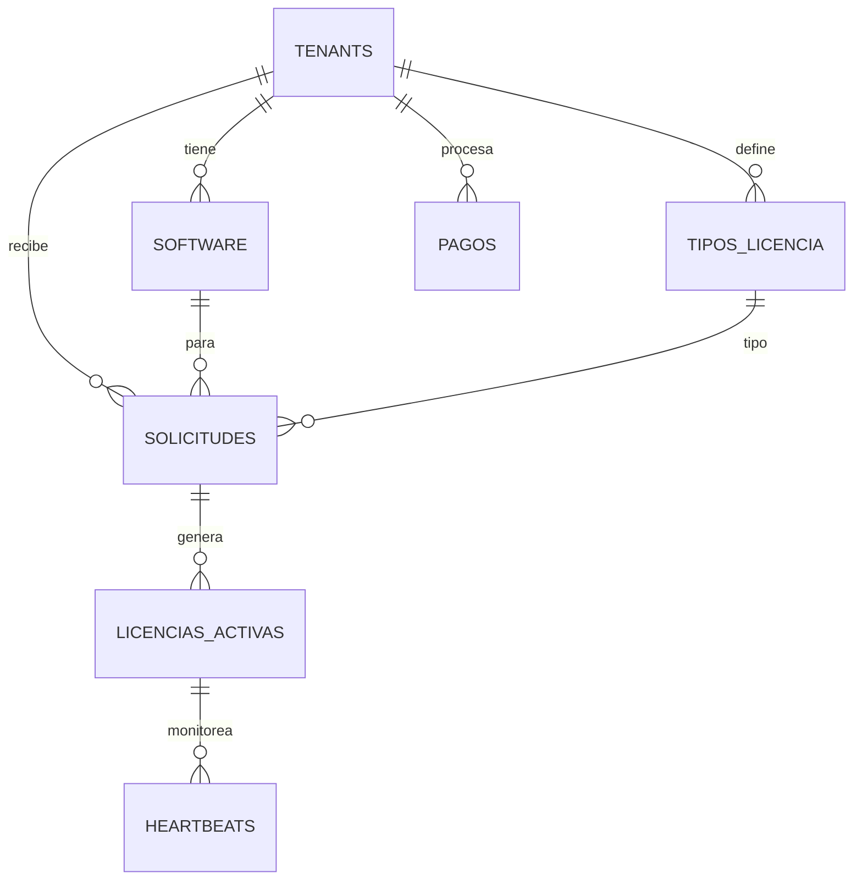

# 🛡️ SafeKeyLicensing - Sistema de Gestión de Licencias Multi-Tenant

## 📋 Resumen Ejecutivo

**SafeKeyLicensing** es una plataforma empresarial desarrollada en ASP.NET Core 8.0 que permite a múltiples empresas gestionar licencias de software de manera independiente y segura. El sistema implementa una arquitectura multi-tenant que garantiza el aislamiento de datos y la escalabilidad para diferentes tipos de clientes.

## 🎯 Objetivo del Proyecto

Crear una solución SaaS robusta que permita a empresas de software:
- Gestionar licencias de sus productos de forma centralizada
- Controlar el acceso y uso de sus aplicaciones
- Monitorear licencias activas en tiempo real
- Procesar pagos de manera segura
- Generar reportes y análisis de uso

## 🏗️ Arquitectura del Sistema

### Estructura de la Solución

```
SafeKeyLicensingSol/
├── SafeKeyLicensing/                    # 🌐 Aplicación Web Principal
│   ├── Controllers/                     # Controladores MVC
│   ├── Data/                           # Contexto de Entity Framework
│   ├── Models/                         # Modelos de datos
│   ├── Views/                          # Vistas Razor
│   └── Areas/Identity/                 # Área de autenticación
├── SafeKeyLicensingSol.AppHost/        # 🚀 Host de .NET Aspire
└── SafeKeyLicensingSol.ServiceDefaults/ # ⚙️ Configuraciones compartidas
```

### Tecnologías Principales

| Tecnología | Versión | Propósito |
|------------|---------|-----------|
| ASP.NET Core | 8.0 | Framework web principal |
| Entity Framework Core | 8.0 | ORM para acceso a datos |
| PostgreSQL | 15+ | Base de datos principal con capacidades NoSQL (JSONB) |
| Npgsql | 8.0 | Proveedor PostgreSQL para .NET |
| .NET Aspire | Latest | Orquestación y observabilidad |
| ASP.NET Identity | 8.0 | Sistema de autenticación |
| OpenTelemetry | Latest | Monitoreo y observabilidad |

## 🏢 Modelo Multi-Tenant

### Concepto de Tenant

Un **tenant** representa una empresa cliente que utiliza el sistema para gestionar sus licencias de software. Cada tenant opera de forma completamente aislada:

- **Datos separados**: Cada tenant solo accede a sus propios datos
- **Configuración independiente**: Límites y planes personalizables
- **Facturación separada**: Cada tenant maneja sus propios pagos
- **Branding personalizable**: Logo y configuraciones visuales propias

### Planes de Suscripción

| Plan | Licencias | Usuarios | Softwares | Precio Base |
|------|-----------|----------|-----------|-------------|
| **Free** | 100 | 10 | 5 | Gratis |
| **Professional** | 500 | 50 | 20 | $99/mes |
| **Enterprise** | 1000+ | 100+ | 50+ | $299/mes |

## 💾 Modelo de Datos Híbrido (SQL + NoSQL)

### Base de Datos PostgreSQL con Capacidades NoSQL

SafeKeyLicensing aprovecha las capacidades híbridas de PostgreSQL, combinando el poder de SQL relacional con la flexibilidad de NoSQL:

#### 🔄 **Datos Estructurados (SQL)**
- **Entidades principales**: Tenants, Licencias, Usuarios, Software
- **Relaciones normalizadas**: Foreign keys, constraints, índices optimizados
- **ACID compliance**: Transacciones seguras para operaciones críticas
- **Consultas complejas**: JOINs, agregaciones, análisis

#### 📊 **Datos Flexibles (NoSQL - JSONB)**
- **Metadatos de pagos**: Información variable de diferentes proveedores
- **Configuraciones de tenant**: Settings personalizables por cliente
- **Logs de actividad**: Datos de auditoría con estructura variable
- **Hardware info**: Información de dispositivos en formato flexible

#### 🔍 **Características Avanzadas**
- **Full-text search**: Búsqueda en texto completo en español
- **Array operations**: Manejo de listas (IPs permitidas, características)
- **GIN indexes**: Índices optimizados para JSONB y arrays
- **Generated columns**: Columnas calculadas para optimizar consultas

### Entidades Principales

#### 🏢 Tenants
```sql
- Id, Nombre, TenantId (único)
- Límites: MaxLicencias, MaxUsuarios, MaxSoftwares
- Plan, Estado (Activo/Inactivo)
- Información de contacto y branding
- Configuración de pagos (Stripe, PayPal)
```

#### 💿 Software
```sql
- Productos de software a licenciar
- Versionado y descripción
- Estado activo/inactivo
- Asociado a un tenant específico
```

#### 📜 TiposLicencia
```sql
- Básica: $10 - Uso personal, soporte email
- Profesional: $10-30 - Características avanzadas
- Premium: $60-100 - Múltiples usuarios, soporte 24/7
- Enterprise: $300-500 - Soporte prioritario, características enterprise
```

#### 📋 Solicitudes
```sql
- Peticiones de licencias de clientes
- Información del cliente y hardware
- Estados: Pendiente, Aprobada, Rechazada
- Precio y tipo de licencia solicitada
```

#### 🔑 LicenciasActivas
```sql
- Licencias generadas y en uso
- API Key única para validación
- Hardware vinculado (HDD ID, Motherboard ID)
- Fechas de inicio y vencimiento
- Monitoreo de heartbeats
```

#### 💳 Pagos
```sql
- Gestión completa de transacciones
- Múltiples métodos de pago
- Estados y referencias externas
- Auditoría completa de pagos
```

### Diagramas de Relaciones



## 🔧 Funcionalidades del Sistema

### 🎫 Gestión de Licencias

#### Flujo de Licenciamiento
1. **Solicitud**: Cliente solicita licencia para software específico
2. **Validación**: Verificación de hardware y datos del cliente
3. **Pago**: Procesamiento de pago según tipo de licencia
4. **Generación**: Creación de API Key y activación
5. **Monitoreo**: Heartbeats periódicos para validar uso

#### Características Avanzadas
- **Vinculación de Hardware**: Licencias atadas a dispositivos específicos
- **Validación en Tiempo Real**: API para verificar licencias activas
- **Control de Expiración**: Gestión automática de vencimientos
- **Transferencia de Licencias**: Migración entre dispositivos (con límites)

### 💰 Sistema de Pagos

#### Métodos Soportados
- **Stripe**: Tarjetas de crédito, pagos recurrentes
- **PayPal**: Pagos únicos y suscripciones
- **Transferencias**: Para clientes enterprise

#### Características
- **Multi-moneda**: USD, EUR, MXN y más
- **Facturación Automática**: Renovaciones automáticas
- **Reportes Financieros**: Análisis de ingresos por tenant
- **Gestión de Reembolsos**: Proceso automatizado

### 📊 Monitoreo y Análisis

#### Heartbeats
- **Frecuencia**: Cada 30 minutos (configurable)
- **Validación**: Hardware, IP, estado de licencia
- **Alertas**: Notificaciones de uso anómalo
- **Auto-desactivación**: Licencias sin heartbeat por >60 minutos

#### Reportes Disponibles
- **Dashboard por Tenant**: Métricas en tiempo real
- **Análisis de Uso**: Patrones de utilización
- **Ingresos**: Reportes financieros detallados
- **Auditoría**: Logs completos de actividad

## 🔐 Seguridad y Compliance

### Autenticación y Autorización
- **ASP.NET Identity**: Gestión de usuarios y roles
- **Multi-Factor Authentication**: Seguridad adicional
- **Confirmación de Email**: Verificación obligatoria
- **Políticas de Contraseña**: Configurables por tenant

### Protección de Datos
- **Aislamiento Multi-Tenant**: Datos completamente separados
- **Encriptación**: Datos sensibles encriptados en base de datos
- **Auditoría Completa**: Registro de todas las operaciones
- **Backup Automático**: Respaldos diarios de datos

### Compliance
- **GDPR**: Derecho al olvido y portabilidad de datos
- **SOC 2**: Controles de seguridad empresarial
- **PCI DSS**: Cumplimiento para pagos con tarjeta

## 🚀 Observabilidad con .NET Aspire

### Monitoreo Distribuido
- **OpenTelemetry**: Trazas, métricas y logs unificados
- **Health Checks**: Verificación de salud de servicios
- **Service Discovery**: Descubrimiento automático de servicios
- **Dashboard Centralizado**: Vista unificada del sistema

### Métricas Clave
- **Performance**: Tiempo de respuesta, throughput
- **Negocio**: Licencias activas, ingresos, conversiones
- **Infraestructura**: CPU, memoria, conexiones DB
- **Errores**: Tasa de errores y alertas

## 📈 Escalabilidad

### Arquitectura Preparada para Escalar
- **Multi-Tenant Nativo**: Aislamiento eficiente de datos
- **Microservicios**: Separación de responsabilidades
- **Caching Distribuido**: Redis para alta performance
- **Load Balancing**: Distribución de carga automática

### Planes de Crecimiento
- **Horizontal**: Múltiples instancias de aplicación
- **Vertical**: Escalado de recursos por tenant
- **Geográfico**: Despliegue en múltiples regiones
- **Funcional**: Microservicios especializados

## 🛠️ Instalación y Configuración

### Prerrequisitos
```bash
- .NET 8.0 SDK
- PostgreSQL 15+
- Visual Studio 2022 o VS Code
- Docker (opcional, para contenedores)
```

### Configuración de Base de Datos
1. Crear base de datos PostgreSQL
2. Ejecutar script `SafeKeyLicensing_BD.sql`
3. Configurar connection string en `appsettings.json`

### Variables de Entorno
```json
{
  "ConnectionStrings": {
    "DefaultConnection": "Server=localhost;Database=SafeKeyLicensing;..."
  },
  "Stripe": {
    "SecretKey": "sk_test_...",
    "PublishableKey": "pk_test_..."
  },
  "PayPal": {
    "ClientId": "...",
    "ClientSecret": "..."
  }
}
```

## 📚 APIs Disponibles

### Autenticación
```http
POST /api/auth/login
POST /api/auth/register
POST /api/auth/refresh-token
```

### Licencias
```http
GET /api/licenses/validate/{apiKey}
POST /api/licenses/heartbeat
GET /api/licenses/tenant/{tenantId}
POST /api/licenses/request
```

### Pagos
```http
POST /api/payments/create
GET /api/payments/status/{paymentId}
POST /api/payments/webhook/stripe
POST /api/payments/webhook/paypal
```

## 🔄 Estados del Sistema

### Estados de Solicitudes
- **Pendiente**: Esperando revisión manual
- **Aprobada**: Lista para pago
- **Pagada**: Pago procesado, esperando activación
- **Activa**: Licencia generada y activa
- **Rechazada**: Solicitud denegada
- **Expirada**: Licencia vencida

### Estados de Pagos
- **Pendiente**: Esperando procesamiento
- **Procesando**: En curso de pago
- **Completado**: Pago exitoso
- **Fallido**: Error en el pago
- **Reembolsado**: Dinero devuelto
- **Cancelado**: Transacción cancelada

## 📋 Roadmap del Proyecto

### Fase 1 - MVP (Actual)
- [x] Arquitectura base multi-tenant
- [x] Autenticación con Identity
- [x] Modelo de datos completo
- [ ] APIs básicas de licenciamiento
- [ ] Integración de pagos básica

### Fase 2 - Core Features
- [ ] Dashboard para tenants
- [ ] Gestión completa de licencias
- [ ] Sistema de heartbeats
- [ ] Reportes básicos
- [ ] Notificaciones por email

### Fase 3 - Advanced Features
- [ ] APIs públicas para clientes
- [ ] Webhooks para integraciones
- [ ] Análisis avanzados
- [ ] Mobile app para gestión
- [ ] Integración con CRM

### Fase 4 - Enterprise
- [ ] SSO con SAML/OAuth
- [ ] API de terceros avanzada
- [ ] Marketplace de plugins
- [ ] IA para detección de fraude
- [ ] Compliance completo

## 👥 Equipo y Contacto

### Roles del Proyecto
- **Product Owner**: Definición de funcionalidades
- **Tech Lead**: Arquitectura y decisiones técnicas
- **DevOps**: Infraestructura y despliegue
- **QA**: Pruebas y calidad
- **UI/UX**: Experiencia de usuario

### Contribuciones
Este proyecto sigue las mejores prácticas de desarrollo:
- **Git Flow**: Ramas feature, develop, main
- **Code Review**: Revisión obligatoria de código
- **Testing**: Cobertura mínima del 80%
- **Documentation**: Documentación actualizada

## 📄 Licencia

Este proyecto está bajo licencia MIT. Ver `LICENSE` para más detalles.

---

**Última actualización**: Octubre 2025  
**Versión del documento**: 1.0  
**Estado del proyecto**: En desarrollo activo