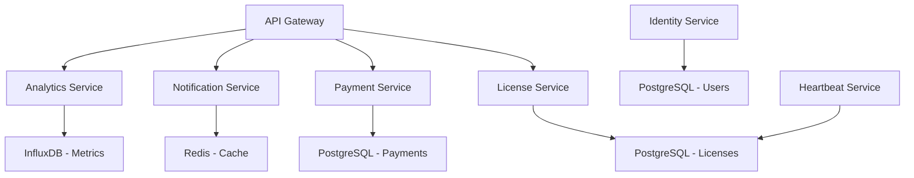

# 📋 Especificaciones Técnicas - SafeKeyLicensing

## 🏗️ Arquitectura Técnica Detallada

### Patrones de Diseño Implementados

#### 1. Multi-Tenancy Pattern
```csharp
// Implementación de aislamiento por TenantId en cada query
public async Task<List<Software>> GetSoftwareByTenantAsync(int tenantId)
{
    return await _context.Software
        .Where(s => s.TenantId == tenantId)
        .ToListAsync();
}
```

#### 2. Repository Pattern
```csharp
public interface IGenericRepository<T> where T : class
{
    Task<T> GetByIdAsync(int id, int tenantId);
    Task<List<T>> GetAllAsync(int tenantId);
    Task<T> AddAsync(T entity);
    Task UpdateAsync(T entity);
    Task DeleteAsync(int id, int tenantId);
}
```

#### 3. Unit of Work Pattern
```csharp
public interface IUnitOfWork
{
    ITenantRepository Tenants { get; }
    ISoftwareRepository Software { get; }
    ILicenseRepository Licenses { get; }
    IPaymentRepository Payments { get; }
    Task<int> SaveChangesAsync();
}
```

### Estructura de Microservicios



## 🔧 Configuración de Servicios

### Dependency Injection Configuration

```csharp
// Program.cs - Configuración de servicios
public static void ConfigureServices(this IServiceCollection services, IConfiguration configuration)
{
    // Database - PostgreSQL with JSON/NoSQL capabilities
    services.AddDbContext<ApplicationDbContext>(options =>
        options.UseNpgsql(configuration.GetConnectionString("DefaultConnection"), 
            npgsqlOptions => {
                npgsqlOptions.EnableRetryOnFailure(3);
                npgsqlOptions.UseQuerySplittingBehavior(QuerySplittingBehavior.SplitQuery);
            }));
    
    // Multi-tenancy
    services.AddScoped<ITenantProvider, TenantProvider>();
    services.AddScoped<ITenantService, TenantService>();
    
    // Repositories
    services.AddScoped<IUnitOfWork, UnitOfWork>();
    services.AddScoped(typeof(IGenericRepository<>), typeof(GenericRepository<>));
    
    // Business Services
    services.AddScoped<ILicenseService, LicenseService>();
    services.AddScoped<IPaymentService, PaymentService>();
    services.AddScoped<IHeartbeatService, HeartbeatService>();
    
    // External Services
    services.AddScoped<IStripeService, StripeService>();
    services.AddScoped<IPayPalService, PayPalService>();
    services.AddScoped<IEmailService, EmailService>();
    
    // Caching
    services.AddStackExchangeRedisCache(options =>
        options.Configuration = configuration.GetConnectionString("Redis"));
    
    // Background Services
    services.AddHostedService<HeartbeatMonitoringService>();
    services.AddHostedService<LicenseExpirationService>();
}
```

### Entity Framework Configuration

```csharp
// ApplicationDbContext.cs - PostgreSQL with NoSQL capabilities
public class ApplicationDbContext : IdentityDbContext<ApplicationUser>
{
    private readonly ITenantProvider _tenantProvider;
    
    public ApplicationDbContext(DbContextOptions<ApplicationDbContext> options, 
                               ITenantProvider tenantProvider) : base(options)
    {
        _tenantProvider = tenantProvider;
    }
    
    protected override void OnModelCreating(ModelBuilder builder)
    {
        base.OnModelCreating(builder);
        
        // Configure PostgreSQL-specific features
        builder.HasPostgresExtension("uuid-ossp");
        builder.HasPostgresExtension("hstore");
        
        // Global query filters for multi-tenancy
        foreach (var entityType in builder.Model.GetEntityTypes())
        {
            if (typeof(ITenantEntity).IsAssignableFrom(entityType.ClrType))
            {
                var parameter = Expression.Parameter(entityType.ClrType, "e");
                var property = Expression.Property(parameter, nameof(ITenantEntity.TenantId));
                var tenantId = Expression.Constant(_tenantProvider.GetCurrentTenantId());
                var filter = Expression.Lambda(Expression.Equal(property, tenantId), parameter);
                
                builder.Entity(entityType.ClrType).HasQueryFilter(filter);
            }
        }
        
        // Entity configurations with PostgreSQL NoSQL features
        builder.ApplyConfiguration(new TenantConfiguration());
        builder.ApplyConfiguration(new SoftwareConfiguration());
        builder.ApplyConfiguration(new LicenseConfiguration());
        builder.ApplyConfiguration(new PaymentConfiguration());
    }
}

// Example of PostgreSQL NoSQL configuration
public class PaymentConfiguration : IEntityTypeConfiguration<Payment>
{
    public void Configure(EntityTypeBuilder<Payment> builder)
    {
        builder.ToTable("Pagos");
        
        // Configure JSONB column for flexible data storage
        builder.Property(e => e.DatosTransaccion)
            .HasColumnType("jsonb")
            .HasColumnName("DatosTransaccion");
            
        // Configure metadata as JSONB
        builder.Property(e => e.Metadata)
            .HasColumnType("jsonb")
            .HasColumnName("Metadata");
            
        // PostgreSQL-specific indexes
        builder.HasIndex(e => e.DatosTransaccion)
            .HasMethod("gin")
            .HasDatabaseName("IX_Pagos_DatosTransaccion_gin");
            
        // Generated column for extracting JSON values
        builder.Property<string>("PaymentMethod")
            .HasComputedColumnSql("(\"DatosTransaccion\"->>'method')", stored: true);
    }
}
```

## 🐘 PostgreSQL NoSQL Features

### JSONB Storage and Querying

```csharp
// Service using PostgreSQL JSONB features
public class PaymentService : IPaymentService
{
    private readonly ApplicationDbContext _context;
    
    public async Task<Payment> CreatePaymentAsync(CreatePaymentRequest request)
    {
        var payment = new Payment
        {
            Monto = request.Amount,
            // Store complex data as JSONB
            DatosTransaccion = new PaymentTransactionData
            {
                Method = request.PaymentMethod,
                Provider = request.Provider,
                CustomerData = request.CustomerData,
                BillingAddress = request.BillingAddress,
                Items = request.Items
            },
            // Store flexible metadata
            Metadata = new Dictionary<string, object>
            {
                ["userAgent"] = request.UserAgent,
                ["ipAddress"] = request.IpAddress,
                ["deviceInfo"] = request.DeviceInfo,
                ["campaignId"] = request.CampaignId
            }
        };
        
        _context.Payments.Add(payment);
        await _context.SaveChangesAsync();
        return payment;
    }
    
    // Query JSONB data using PostgreSQL operators
    public async Task<List<Payment>> GetPaymentsByMethodAsync(string method, int tenantId)
    {
        return await _context.Payments
            .Where(p => p.TenantId == tenantId)
            .Where(p => EF.Functions.JsonExtractPathText(p.DatosTransaccion, "method") == method)
            .ToListAsync();
    }
    
    // Complex JSONB queries
    public async Task<List<Payment>> GetPaymentsByComplexCriteriaAsync(PaymentSearchCriteria criteria)
    {
        var query = _context.Payments.AsQueryable();
        
        // Filter by JSON path
        if (!string.IsNullOrEmpty(criteria.Provider))
        {
            query = query.Where(p => 
                EF.Functions.JsonExtractPathText(p.DatosTransaccion, "provider") == criteria.Provider);
        }
        
        // Filter by JSON array contains
        if (criteria.Tags?.Any() == true)
        {
            foreach (var tag in criteria.Tags)
            {
                query = query.Where(p => 
                    EF.Functions.JsonContains(p.Metadata, $"\"{tag}\"", "tags"));
            }
        }
        
        // Filter by nested JSON properties
        if (criteria.MinAmount.HasValue)
        {
            query = query.Where(p => 
                EF.Functions.JsonExtractPath<decimal>(p.DatosTransaccion, "amount") >= criteria.MinAmount);
        }
        
        return await query.ToListAsync();
    }
}

// Custom PostgreSQL functions for advanced JSONB operations
public static class PostgreSqlExtensions
{
    public static IQueryable<T> WhereJsonContainsKey<T>(
        this IQueryable<T> query,
        Expression<Func<T, string>> jsonColumn,
        string key) where T : class
    {
        return query.Where(entity => 
            EF.Functions.JsonContains(
                EF.Property<string>(entity, jsonColumn.GetPropertyName()), 
                $"{{\"key\":\"{key}\"}}"
            ));
    }
    
    public static IQueryable<T> WhereJsonPathExists<T>(
        this IQueryable<T> query,
        Expression<Func<T, string>> jsonColumn,
        string path) where T : class
    {
        return query.Where(entity => 
            EF.Functions.JsonExists(
                EF.Property<string>(entity, jsonColumn.GetPropertyName()), 
                path
            ));
    }
}
```

### PostgreSQL Full-Text Search

```csharp
// Full-text search configuration
public class SoftwareConfiguration : IEntityTypeConfiguration<Software>
{
    public void Configure(EntityTypeBuilder<Software> builder)
    {
        // Configure full-text search vector
        builder.Property<NpgsqlTsVector>("SearchVector")
            .HasComputedColumnSql(
                "to_tsvector('spanish', coalesce(\"Nombre\",'') || ' ' || coalesce(\"Descripcion\",''))",
                stored: true);
                
        builder.HasIndex("SearchVector")
            .HasMethod("gin");
    }
}

// Service using full-text search
public class SoftwareSearchService
{
    public async Task<List<Software>> SearchSoftwareAsync(string searchTerm, int tenantId)
    {
        return await _context.Software
            .Where(s => s.TenantId == tenantId)
            .Where(s => s.SearchVector.Matches(EF.Functions.ToTsQuery("spanish", searchTerm)))
            .OrderByDescending(s => s.SearchVector.Rank(EF.Functions.ToTsQuery("spanish", searchTerm)))
            .ToListAsync();
    }
}
```

### PostgreSQL Array Operations

```csharp
// Entity with array fields
public class License
{
    public int Id { get; set; }
    public string[] AllowedIPs { get; set; } // PostgreSQL array
    public string[] Features { get; set; }   // PostgreSQL array
    public Dictionary<string, string> Configuration { get; set; } // JSONB
}

// Configuration for arrays
public class LicenseConfiguration : IEntityTypeConfiguration<License>
{
    public void Configure(EntityTypeBuilder<License> builder)
    {
        // Configure PostgreSQL arrays
        builder.Property(e => e.AllowedIPs)
            .HasColumnType("text[]");
            
        builder.Property(e => e.Features)
            .HasColumnType("text[]");
            
        // Index for array operations
        builder.HasIndex(e => e.AllowedIPs)
            .HasMethod("gin");
    }
}

// Service using array operations
public class LicenseService
{
    public async Task<bool> IsIpAllowedAsync(string licenseId, string ipAddress)
    {
        return await _context.Licenses
            .Where(l => l.LicenciaId == licenseId)
            .Where(l => l.AllowedIPs.Contains(ipAddress))
            .AnyAsync();
    }
    
    public async Task<List<License>> GetLicensesWithFeatureAsync(string feature)
    {
        return await _context.Licenses
            .Where(l => l.Features.Contains(feature))
            .ToListAsync();
    }
}
```

## 🔐 Seguridad y Autenticación

### JWT Configuration

```csharp
// JWT Service Implementation
public class JwtService : IJwtService
{
    private readonly JwtSettings _jwtSettings;
    
    public string GenerateToken(ApplicationUser user, int tenantId)
    {
        var claims = new[]
        {
            new Claim(JwtRegisteredClaimNames.Sub, user.Id),
            new Claim(JwtRegisteredClaimNames.Email, user.Email),
            new Claim("tenantId", tenantId.ToString()),
            new Claim(JwtRegisteredClaimNames.Jti, Guid.NewGuid().ToString())
        };
        
        var key = new SymmetricSecurityKey(Encoding.UTF8.GetBytes(_jwtSettings.Key));
        var creds = new SigningCredentials(key, SecurityAlgorithms.HmacSha256);
        
        var token = new JwtSecurityToken(
            issuer: _jwtSettings.Issuer,
            audience: _jwtSettings.Audience,
            claims: claims,
            expires: DateTime.Now.AddMinutes(_jwtSettings.DurationInMinutes),
            signingCredentials: creds);
        
        return new JwtSecurityTokenHandler().WriteToken(token);
    }
}
```

### API Key Authentication

```csharp
// API Key Authentication Handler
public class ApiKeyAuthenticationHandler : AuthenticationHandler<ApiKeyAuthenticationSchemeOptions>
{
    private readonly ILicenseService _licenseService;
    
    protected override async Task<AuthenticateResult> HandleAuthenticateAsync()
    {
        if (!Request.Headers.TryGetValue("X-API-Key", out var apiKeyHeaderValues))
        {
            return AuthenticateResult.NoResult();
        }
        
        var providedApiKey = apiKeyHeaderValues.FirstOrDefault();
        if (string.IsNullOrWhiteSpace(providedApiKey))
        {
            return AuthenticateResult.NoResult();
        }
        
        var license = await _licenseService.ValidateApiKeyAsync(providedApiKey);
        if (license == null || !license.IsActive)
        {
            return AuthenticateResult.Fail("Invalid API Key");
        }
        
        var claims = new[]
        {
            new Claim("apiKey", providedApiKey),
            new Claim("licenseId", license.Id.ToString()),
            new Claim("tenantId", license.TenantId.ToString())
        };
        
        var identity = new ClaimsIdentity(claims, Scheme.Name);
        var principal = new ClaimsPrincipal(identity);
        var ticket = new AuthenticationTicket(principal, Scheme.Name);
        
        return AuthenticateResult.Success(ticket);
    }
}
```

## 💳 Sistema de Pagos

### Stripe Integration

```csharp
// Stripe Payment Service
public class StripePaymentService : IPaymentService
{
    private readonly StripeClient _stripeClient;
    private readonly PaymentIntentService _paymentIntentService;
    
    public async Task<PaymentResult> CreatePaymentAsync(PaymentRequest request)
    {
        var options = new PaymentIntentCreateOptions
        {
            Amount = (long)(request.Amount * 100), // Convert to cents
            Currency = request.Currency.ToLower(),
            Metadata = new Dictionary<string, string>
            {
                {"tenantId", request.TenantId.ToString()},
                {"licenseRequestId", request.LicenseRequestId.ToString()}
            }
        };
        
        var paymentIntent = await _paymentIntentService.CreateAsync(options);
        
        return new PaymentResult
        {
            PaymentId = paymentIntent.Id,
            ClientSecret = paymentIntent.ClientSecret,
            Status = paymentIntent.Status
        };
    }
    
    public async Task<bool> ConfirmPaymentAsync(string paymentId)
    {
        var paymentIntent = await _paymentIntentService.GetAsync(paymentId);
        return paymentIntent.Status == "succeeded";
    }
}
```

### PayPal Integration

```csharp
// PayPal Payment Service
public class PayPalPaymentService : IPaymentService
{
    private readonly PayPalHttpClient _client;
    
    public async Task<PaymentResult> CreatePaymentAsync(PaymentRequest request)
    {
        var payment = new OrderRequest()
        {
            CheckoutPaymentIntent = "CAPTURE",
            PurchaseUnits = new List<PurchaseUnitRequest>()
            {
                new PurchaseUnitRequest()
                {
                    AmountWithBreakdown = new AmountWithBreakdown()
                    {
                        CurrencyCode = request.Currency,
                        Value = request.Amount.ToString("F2")
                    }
                }
            }
        };
        
        var orderRequest = new OrdersCreateRequest();
        orderRequest.Prefer("return=representation");
        orderRequest.RequestBody(payment);
        
        var response = await _client.Execute(orderRequest);
        var order = response.Result<Order>();
        
        return new PaymentResult
        {
            PaymentId = order.Id,
            ApprovalUrl = order.Links.FirstOrDefault(l => l.Rel == "approve")?.Href,
            Status = order.Status
        };
    }
}
```

## 📊 Monitoreo y Observabilidad

### Custom Metrics

```csharp
// Custom Metrics Service
public class MetricsService : IMetricsService
{
    private readonly Counter<int> _licenseValidationsCounter;
    private readonly Histogram<double> _paymentProcessingTime;
    private readonly Gauge<int> _activeLicensesGauge;
    
    public MetricsService(IMeterFactory meterFactory)
    {
        var meter = meterFactory.Create("SafeKeyLicensing");
        
        _licenseValidationsCounter = meter.CreateCounter<int>(
            "license_validations_total",
            "Total number of license validations");
            
        _paymentProcessingTime = meter.CreateHistogram<double>(
            "payment_processing_duration_seconds",
            "Time taken to process payments");
            
        _activeLicensesGauge = meter.CreateGauge<int>(
            "active_licenses_count",
            "Current number of active licenses");
    }
    
    public void RecordLicenseValidation(int tenantId, bool isValid)
    {
        _licenseValidationsCounter.Add(1, new TagList
        {
            ["tenant_id"] = tenantId.ToString(),
            ["is_valid"] = isValid.ToString()
        });
    }
}
```

### Health Checks

```csharp
// Custom Health Checks
public class DatabaseHealthCheck : IHealthCheck
{
    private readonly ApplicationDbContext _context;
    
    public async Task<HealthCheckResult> CheckHealthAsync(
        HealthCheckContext context, 
        CancellationToken cancellationToken = default)
    {
        try
        {
            await _context.Database.ExecuteSqlRawAsync("SELECT 1", cancellationToken);
            return HealthCheckResult.Healthy("Database is healthy");
        }
        catch (Exception ex)
        {
            return HealthCheckResult.Unhealthy("Database is unhealthy", ex);
        }
    }
}

public class StripeHealthCheck : IHealthCheck
{
    private readonly IStripeService _stripeService;
    
    public async Task<HealthCheckResult> CheckHealthAsync(
        HealthCheckContext context,
        CancellationToken cancellationToken = default)
    {
        try
        {
            await _stripeService.TestConnectionAsync();
            return HealthCheckResult.Healthy("Stripe service is healthy");
        }
        catch (Exception ex)
        {
            return HealthCheckResult.Unhealthy("Stripe service is unhealthy", ex);
        }
    }
}
```

## 🔄 Background Services

### Heartbeat Monitoring Service

```csharp
// Background service para monitorear heartbeats
public class HeartbeatMonitoringService : BackgroundService
{
    private readonly IServiceProvider _serviceProvider;
    private readonly ILogger<HeartbeatMonitoringService> _logger;
    
    protected override async Task ExecuteAsync(CancellationToken stoppingToken)
    {
        while (!stoppingToken.IsCancellationRequested)
        {
            using var scope = _serviceProvider.CreateScope();
            var heartbeatService = scope.ServiceProvider.GetRequiredService<IHeartbeatService>();
            
            try
            {
                await heartbeatService.CheckExpiredLicensesAsync();
                await heartbeatService.SendHeartbeatAlertsAsync();
            }
            catch (Exception ex)
            {
                _logger.LogError(ex, "Error in heartbeat monitoring service");
            }
            
            await Task.Delay(TimeSpan.FromMinutes(5), stoppingToken);
        }
    }
}
```

### License Expiration Service

```csharp
// Background service para expiración de licencias
public class LicenseExpirationService : BackgroundService
{
    private readonly IServiceProvider _serviceProvider;
    
    protected override async Task ExecuteAsync(CancellationToken stoppingToken)
    {
        while (!stoppingToken.IsCancellationRequested)
        {
            using var scope = _serviceProvider.CreateScope();
            var licenseService = scope.ServiceProvider.GetRequiredService<ILicenseService>();
            
            await licenseService.ProcessExpiredLicensesAsync();
            await Task.Delay(TimeSpan.FromHours(1), stoppingToken);
        }
    }
}
```

## 🧪 Testing Strategy

### Unit Tests Structure

```csharp
// Ejemplo de unit test para LicenseService
[TestClass]
public class LicenseServiceTests
{
    private Mock<IUnitOfWork> _mockUnitOfWork;
    private Mock<ITenantProvider> _mockTenantProvider;
    private LicenseService _licenseService;
    
    [TestInitialize]
    public void Setup()
    {
        _mockUnitOfWork = new Mock<IUnitOfWork>();
        _mockTenantProvider = new Mock<ITenantProvider>();
        _licenseService = new LicenseService(_mockUnitOfWork.Object, _mockTenantProvider.Object);
    }
    
    [TestMethod]
    public async Task ValidateApiKey_ValidKey_ReturnsLicense()
    {
        // Arrange
        var apiKey = "test-api-key";
        var expectedLicense = new LicenseActive { ApiKey = apiKey, Status = "ACTIVA" };
        
        _mockUnitOfWork.Setup(x => x.Licenses.GetByApiKeyAsync(apiKey))
                      .ReturnsAsync(expectedLicense);
        
        // Act
        var result = await _licenseService.ValidateApiKeyAsync(apiKey);
        
        // Assert
        Assert.IsNotNull(result);
        Assert.AreEqual(apiKey, result.ApiKey);
        Assert.AreEqual("ACTIVA", result.Status);
    }
}
```

### Integration Tests

```csharp
// Integration test para API endpoints
[TestClass]
public class LicenseControllerIntegrationTests : IntegrationTestBase
{
    [TestMethod]
    public async Task ValidateLicense_ValidApiKey_ReturnsOk()
    {
        // Arrange
        var apiKey = await CreateTestLicenseAsync();
        
        // Act
        var response = await _client.GetAsync($"/api/licenses/validate/{apiKey}");
        
        // Assert
        response.EnsureSuccessStatusCode();
        var content = await response.Content.ReadAsStringAsync();
        var result = JsonSerializer.Deserialize<LicenseValidationResult>(content);
        
        Assert.IsTrue(result.IsValid);
    }
}
```

## 🚀 Deployment Configuration

### Docker Configuration

```dockerfile
# Dockerfile
FROM mcr.microsoft.com/dotnet/aspnet:8.0 AS base
WORKDIR /app
EXPOSE 80
EXPOSE 443

FROM mcr.microsoft.com/dotnet/sdk:8.0 AS build
WORKDIR /src
COPY ["SafeKeyLicensing/SafeKeyLicensing.csproj", "SafeKeyLicensing/"]
RUN dotnet restore "SafeKeyLicensing/SafeKeyLicensing.csproj"
COPY . .
WORKDIR "/src/SafeKeyLicensing"
RUN dotnet build "SafeKeyLicensing.csproj" -c Release -o /app/build

FROM build AS publish
RUN dotnet publish "SafeKeyLicensing.csproj" -c Release -o /app/publish

FROM base AS final
WORKDIR /app
COPY --from=publish /app/publish .
ENTRYPOINT ["dotnet", "SafeKeyLicensing.dll"]
```

### Docker Compose

```yaml
# docker-compose.yml
version: '3.8'

services:
  safekeylicensing:
    build: .
    ports:
      - "8080:80"
      - "8443:443"
    environment:
      - ASPNETCORE_ENVIRONMENT=Production
      - ConnectionStrings__DefaultConnection=Host=postgres;Database=SafeKeyLicensing;Username=postgres;Password=password
    depends_on:
      - postgres
      - redis
    
  postgres:
    image: postgres:15
    environment:
      POSTGRES_DB: SafeKeyLicensing
      POSTGRES_USER: postgres
      POSTGRES_PASSWORD: admin
      # Enable PostgreSQL extensions for NoSQL features
      POSTGRES_INITDB_ARGS: "--encoding=UTF8 --locale=en_US.UTF-8"
    command: >
      postgres
      -c shared_preload_libraries=pg_stat_statements
      -c pg_stat_statements.track=all
      -c max_connections=200
      -c shared_buffers=256MB
      -c effective_cache_size=1GB
      -c work_mem=4MB
    volumes:
      - postgres_data:/var/lib/postgresql/data
      - ./scripts/init-extensions.sql:/docker-entrypoint-initdb.d/init-extensions.sql
    ports:
      - "5432:5432"
  
  redis:
    image: redis:7-alpine
    ports:
      - "6379:6379"
    volumes:
      - redis_data:/data

volumes:
  postgres_data:
  redis_data:
```

## 📋 Environment Variables

### Development Environment

```bash
# .env.development
ASPNETCORE_ENVIRONMENT=Development
ConnectionStrings__DefaultConnection=Host=localhost;Port=5432;Database=SafeKeyLicensing;Username=postgres;Password=admin;Include Error Detail=true;
ConnectionStrings__Redis=localhost:6379

# PostgreSQL specific settings
POSTGRES_MAX_POOL_SIZE=100
POSTGRES_CONNECTION_IDLE_LIFETIME=300
POSTGRES_COMMAND_TIMEOUT=30

# Stripe Settings
Stripe__SecretKey=sk_test_...
Stripe__PublishableKey=pk_test_...
Stripe__WebhookSecret=whsec_...

# PayPal Settings
PayPal__ClientId=...
PayPal__ClientSecret=...
PayPal__Mode=sandbox

# JWT Settings
JWT__Key=your-super-secret-key-min-32-characters
JWT__Issuer=SafeKeyLicensing
JWT__Audience=SafeKeyLicensing
JWT__DurationInMinutes=60

# Email Settings
Email__SmtpHost=smtp.gmail.com
Email__SmtpPort=587
Email__FromEmail=noreply@safekeylicensing.com
Email__FromName=SafeKey Licensing
```

### Production Environment

```bash
# .env.production
ASPNETCORE_ENVIRONMENT=Production
ConnectionStrings__DefaultConnection=${DATABASE_CONNECTION_STRING}
ConnectionStrings__Redis=${REDIS_CONNECTION_STRING}

# Security
JWT__Key=${JWT_SECRET_KEY}
DataProtection__Key=${DATA_PROTECTION_KEY}

# External Services
Stripe__SecretKey=${STRIPE_SECRET_KEY}
PayPal__ClientId=${PAYPAL_CLIENT_ID}

# Monitoring
ApplicationInsights__ConnectionString=${APP_INSIGHTS_CONNECTION_STRING}
OTEL_EXPORTER_OTLP_ENDPOINT=${TELEMETRY_ENDPOINT}
```

## 🔧 Performance Optimization

### Database Optimization

```sql
-- PostgreSQL-specific optimizations for multi-tenant application
-- GIN indexes for JSONB columns
CREATE INDEX CONCURRENTLY idx_pagos_datos_transaccion_gin 
ON "Pagos" USING gin ("DatosTransaccion");

CREATE INDEX CONCURRENTLY idx_pagos_metadata_gin 
ON "Pagos" USING gin ("Metadata");

-- Partial indexes for active licenses only
CREATE INDEX CONCURRENTLY idx_licencias_activas_tenant_status 
ON "LicenciasActivas" ("TenantId", "Status") 
WHERE "Status" = 'ACTIVA';

-- Composite indexes for frequent queries
CREATE INDEX CONCURRENTLY idx_heartbeats_license_fecha 
ON "Heartbeats" ("LicenciaActivaId", "Fecha" DESC);

-- Index for JSON path queries
CREATE INDEX CONCURRENTLY idx_pagos_payment_method 
ON "Pagos" (("DatosTransaccion"->>'method'));

-- Full-text search indexes
CREATE INDEX CONCURRENTLY idx_software_fulltext 
ON "Software" USING gin(to_tsvector('spanish', "Nombre" || ' ' || "Descripcion"));

-- Array indexes for IP filtering
CREATE INDEX CONCURRENTLY idx_licenses_allowed_ips_gin 
ON "LicenciasActivas" USING gin ("AllowedIPs");

-- Optimize for tenant-specific queries
CREATE INDEX CONCURRENTLY idx_logs_tenant_fecha 
ON "Logs" ("TenantId", "Fecha" DESC) 
WHERE "Nivel" IN ('ERROR', 'WARNING');
```

### Caching Strategy

```csharp
// Cache configuration
services.AddMemoryCache();
services.AddStackExchangeRedisCache(options =>
{
    options.Configuration = configuration.GetConnectionString("Redis");
    options.InstanceName = "SafeKeyLicensing";
});

// Cache service implementation
public class CacheService : ICacheService
{
    private readonly IDistributedCache _distributedCache;
    private readonly IMemoryCache _memoryCache;
    
    public async Task<T> GetAsync<T>(string key)
    {
        // Try memory cache first
        if (_memoryCache.TryGetValue(key, out T cachedValue))
            return cachedValue;
        
        // Try distributed cache
        var bytes = await _distributedCache.GetAsync(key);
        if (bytes != null)
        {
            var value = JsonSerializer.Deserialize<T>(bytes);
            _memoryCache.Set(key, value, TimeSpan.FromMinutes(5));
            return value;
        }
        
        return default(T);
    }
}
```

---

**Documento actualizado**: Octubre 2025  
**Versión**: 2.0  
**Autor**: Equipo de Desarrollo SafeKeyLicensing